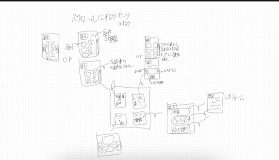

基本設計仕様書

# 目次
1. 概要及び目的
2. システムアーキテクチャ
3. 機能要件
4. 非機能要件
5. データモデル
6. ユーザーインターフェース設計

# 1. 概要及び目的
## 1.1. ソリューションの目的
本ソリューションは、定年後の人々が生活の質（QOL）を維持しながら活動的な生活を送ることのできる社会の実現を目指す。高齢者のQOLが低下する要因の一つに、外出機会の減少がある。本ソリューションは、この問題に対処するために、高齢者が外出のきっかけを持てるようにすることを目的とする。

具体的には、このシステムは冷蔵庫内の食材を把握し、足りないものを判断する。そのうえで、健康によくコスト効率の高いレシピを提案し、それに必要な食材と、それらが手ごろな価格で購入できるスーパーマーケットの場所を表示する。この情報は高齢者がスーパーマーケットへの外出を計画しやすくするためのものである。

さらに、スーパーマーケットではレジで専用のカードをスキャンしてもらうことにより、訪れた時間と場所の位置情報を取得する。これによって高齢者の外出の頻度や距離を記録し、視覚的に表示する機能も備える。この可視化は、外出するモチベーションを維持する手助けとなる。結果として、高齢者が外出する機会が増え、積極的な生活がQOLの向上に寄与することを期待する。

## 1.2. 試作品の概要
本システムの試作品は、冷蔵庫、レジ、カードなどの要素をシミュレーションソフトで作成し、実際の機能を模倣する形で開発する。試作品の冷蔵庫は、食材が冷蔵庫に入れられる前にカメラで撮影し、エッジコンピュータを用いた物体認識で食材を特定する機能を持つ。これにより、冷蔵庫内の食材の種類と個数を管理し、不足しているアイテムを把握することが可能となる。

レジは、実際の小売店のPOSシステムへの導入が理想であるが、試作品では単純化されたソフトウェアを用いてクラウドサーバーとの通信が可能な状態を想定する。このレジシステムは、高齢者が専用のカードをスキャンすることにより、訪れた時間と場所の位置情報を収集し、これらのデータをクラウドサーバーに送信する。

クラウドサーバーでは、情報サイトからレシピを取得し、冷蔵庫内の食材情報をデータベースで管理する役割を担う。サーバーはこれらの情報を基に、健康的でコスト効率の高いレシピを提案し、それに必要な食材が購入できる最適なスーパーマーケットの場所を表示する機能を持つ。

# 2. システムアーキテクチャ

# 3. 機能要件
## 3.1. ディスプレイ
- 冷蔵庫内の食材を表示
- おすすめレシピの表示
- おすすめレシピに足りない食材の表示
- 食材を安くで売っているスーパーマーケットの表示
- ユーザー情報の登録と表示
## 3.2. カメラ
- 冷蔵庫の入出時に食材を自動認識
## 3.3. エッジコンピュータ
- ディスプレイ表示の管理
- カメラを用いた物体認識で食材を特定
- クラウドサーバーからレシピ情報の取得
- 冷蔵庫内の食材名称と個数をクラウドサーバーへ送信
## 3.4. カード
- QRコードの表示
- ユーザー情報の表示と管理
## 3.5. レジ
- QRコードの読み取り
- 購入商品、時刻、場所などの情報をクラウドサーバーへ送信
## 3.6. クラウドサーバー
- 受け取った情報をデータベースに保存
- レシピ情報サイトからレシピを取得
- 冷蔵庫内の食材、ユーザー情報を基におすすめレシピを選択
- おすすめレシピに必要な足りない食材を特定
- 食材が安くで売っているスーパーマーケットを検索
## 3.7. データベース
- 冷蔵庫内の食材、購入商品、購入時刻、購入場所、などの情報を保存
## 3.8. レシピ情報サイト
- 必要な食材をキーワードで検索し、レシピを提供するAPIを有する
# 4. 非機能要件
## 4.1. ディスプレイ
- 誰でも迷うことなく操作できるシンプルなデザイン
- 高齢者が視認しやすいよう、文字サイズは大きめ
- 利用環境に応じた輝度やコントラストの変更可能
## 4.2. カメラ
- 食材を鮮明に認識できる解像度
- 物体認識に最低限のフレームレート
## 4.3. エッジコンピュータ
- 画像認識が可能なプロセッサと十分なメモリ
## 4.4. カード
- 高耐久プラスチックで物理的な摩耗に対する耐性
## 4.5. レジ
- 最低限の通信スペック
## 4.6. クラウドサーバー
- 情報の送受信と各種処理が可能な最低限のスペック
## 4.7. データベース
- データの整合性の保証
# 5. データモデル
# 6. ユーザーインターフェース設計

