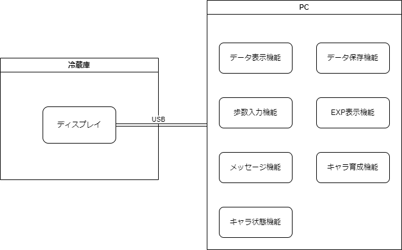

基本設計仕様書

# 目次
1. 概要及び目的
2. システムアーキテクチャ
3. 機能要件
4. 非機能要件
5. データモデル
6. ユーザーインターフェース設計
7. プロトコルとインターフェース

# 1. 概要及び目的
## 1.1. ソリューションの目的
本ソリューションは、定年後の人々が生活の質（QOL）を維持しながら活動的な生活を送ることのできる社会の実現を目指す。
高齢者のQOLが低下する要因の一つに、外出機会の減少がある。
本ソリューションは、この問題に対処するために、高齢者が外出のきっかけを持てるようにすることを目的とする。

具体的には、このシステムは冷蔵庫内の食材を把握し、足りないものを判断する。
そのうえで、健康によくコスト効率の高いレシピを提案し、それに必要な食材と、それらが手ごろな価格で購入できるスーパーマーケットの場所を表示する。この情報は高齢者がスーパーマーケットへの外出を計画しやすくするためのものである。

また、外出のきっかけを増やす工夫として、毎日一定の時間に冷蔵庫から買い物の指示をする。
その際、提案するレシピの食欲をそそるような画像をディスプレイに表示することで、その時間に外出をする理由ができ、きっかけを増やすことができると期待する。

ターゲットとする高齢者像として、高血圧で医師から食事制限と運動を勧められているがモチベーションがない高齢者を対象とする。
医師から受けた食事制限や運動を、楽しみながら行う工夫として、「どのくらい歩けば何を食べたのと同じカロリー消費」などの情報を利用する。
提案されたレシピを食べるためにあるスーパーまで歩くとその分のカロリーが消費され、帰ってくると食べることができるということを歩いてスーパーマーケットに行くモチベーションになると期待する。
結果として、高齢者が歩いて外出する機会が増え、積極的な生活がQOLの向上に寄与することを期待する。

## 1.2. 試作品の概要
本システムの試作品は、冷蔵庫の中の食材情報を活用するディスプレイ表示とする。
冷蔵庫内の食材の画像認識はすでにある[（パナソニック "Live Pantry"）](https://panasonic.jp/reizo/function/camera.html)ので優先順位は低く、ここから得られる情報の見せ方に焦点を当てる。

冷蔵庫のディスプレイではおすすめする料理の画像と必要な食材、料理のカロリー、足りない食材、累計歩数を表示し、特定の時間になったときに外出を促す。
試作品では、歩数は別機器で測定されたものをディスプレイに入力することとする。
料理分のカロリーを消費できると、レシピが表示されるようにする。
冷蔵庫は常に不足する食材を提示できるように、プラスα食材を用意している。

# 2. システムアーキテクチャ

# 3. 機能要件
## 3.1. ディスプレイ
- 各種データを表示する
## 3.2. データ表示機能
- レシピ画像、使用食材、不足食材、カロリー消費バー、歩数入力箇所を表示する
## 3.3. データ保存機能
- レシピ画像、使用食材、庫内食材、レシピカロリー、累計歩数を保存する
## 3.4. 歩数入力機能
- 入力された歩数を累計歩数に合算して保存する
## 3.5. 歩数表示機能
- 高血圧対策で運動を意識させるために累計歩数を表示する
## 3.6. メッセージ機能
- 一日のある一定時刻にユーザーが外出しなければならなくなるようなメッセージを表示する
- 次にユーザーがすべき行動についてのメッセージを画面に常に表示しておく
- メッセージ詳細
  - 今日のレシピ：
  ○○に含まれる○○は血圧を抑える作用があります。
  - 外出催促：
  今日は○○スーパーの○○がお得です。また、適度な運動は血圧を下げる効果があります。
  - 料理レシピ解除：
  今日は○○歩歩きましたね。お疲れ様でした。レシピを解除しました。
## 3.7. スーパーマーケット表示機能
- 足りない食材を買いに行くスーパーマーケットをタッチするとマップで表示する
## 3.8. シナリオ
システム状態遷移図

https://drive.google.com/file/d/1F_cPcqr8FzL47q18A91EpKL5uHszz2g0/view?usp=sharing

# 4. 非機能要件
## 4.1. ディスプレイ
- 誰でも迷うことなく操作できるシンプルなデザイン
- 高齢者が視認しやすいよう、文字サイズは大きめ
## 3.2. データ表示機能
- なし
## 3.3. データ保存機能
- json形式で保存する
## 3.4. 歩数入力機能
- タッチパネルではなくキーボードから入力する
## 3.5. カロリー計算機能
- なし

# 5. データモデル

# 6. ユーザーインターフェース設計

# 7. プロトコルとインターフェース
## 7.1. エッジコンピュータ　－　カメラ
- データ形式：　画像
- プロトコル：　ONVIF
- インターフェース：　USB3.0

## 7.2. サーバー（エッジコンピュータ）　－　ディスプレイ
- データ形式：　映像と音声
- プロトコル：　DRM
- インターフェース：　HDMI

## 7.3. サーバー　－　データベース
- データ形式：　JSON
- プロトコル：　HTTP
- インターフェース：　REST API

## 7.4. サーバー（エッジコンピュータ）　－　Map
- データ形式：　JSON
- プロトコル：　HTTPS
- インターフェース：　REST API
